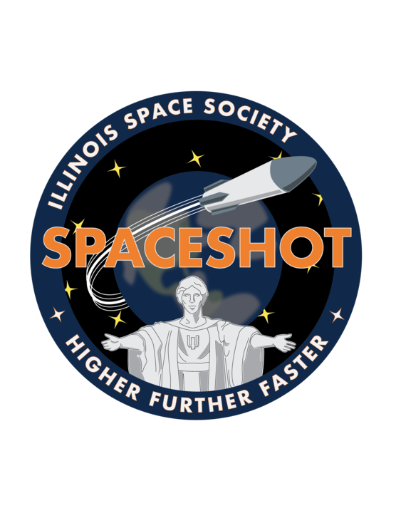

# ISS GNC Onboarding

Hello! Welcome to the Spaceshot's GNC team! This serves as the repository for all onboarding GNC needs. To run, please run the following commands: 

```bash
uv sync              # install deps into .venv (uses the pinned Python)
uv run python app.py # start the server
```
From there, open: <http://127.0.0.1:5000>, type your name once, and work through the modules.

jonathan was here

